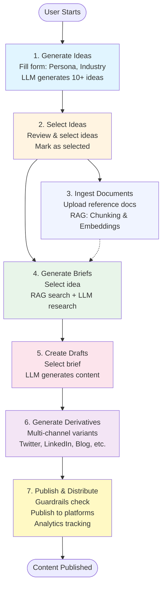

# Content Multiplier - User Workflow Guide

## 📋 Tổng quan

Content Multiplier là một hệ thống AI-powered để tạo, quản lý và phân phối nội dung đa kênh. Workflow chính đi qua 7 bước từ ý tưởng đến xuất bản.

---

## 🔄 User Workflow - Text Description

### **Bước 1: Generate Ideas (Tạo ý tưởng)**
**Mục đích**: Tạo ra nhiều ý tưởng nội dung phù hợp với đối tượng và ngành nghề

**Hành động người dùng**:
- Điền form trên trang `/ideas`:
  - **Persona**: Đối tượng mục tiêu (ví dụ: "Marketing Manager at B2B SaaS")
  - **Industry**: Ngành nghề (ví dụ: "SaaS", "Fintech", "Healthcare")
  - **Corpus Hints**: Từ khóa/topic gợi ý (tùy chọn)
  - **Count**: Số lượng ý tưởng muốn tạo (mặc định: 10)
  - **Temperature**: Độ sáng tạo (0-2, mặc định: 0.8)
- Nhấn nút "Generate Ideas"
- Hệ thống sử dụng LLM để tạo danh sách ý tưởng với:
  - Title (one-liner)
  - Description
  - Angle
  - Scores (Novelty, Demand, Fit)
  - Tags

**Kết quả**: Danh sách 10+ ý tưởng được lưu vào database và hiển thị trên UI

---

### **Bước 2: Select Ideas (Chọn ý tưởng)**
**Mục đích**: Chọn các ý tưởng phù hợp để phát triển thành brief

**Hành động người dùng**:
- Xem danh sách ideas trên trang `/ideas`
- Đánh giá ideas dựa trên:
  - Scores (N/D/F)
  - Tags
  - Description và Angle
- Click nút "Select" trên các ideas muốn phát triển
- Có thể thêm/sửa tags cho ideas

**Kết quả**: Các ideas được đánh dấu status = "selected", có thể xem trên trang `/briefs`

---

### **Bước 3: Ingest Documents (RAG) - Tùy chọn**
**Mục đích**: Nạp tài liệu tham khảo vào hệ thống RAG để hỗ trợ nghiên cứu

**Hành động người dùng**:
- Truy cập trang `/documents`
- Upload hoặc nhập tài liệu:
  - **Title**: Tiêu đề tài liệu
  - **URL**: Link nguồn (nếu có)
  - **Content**: Nội dung văn bản
  - **Author**: Tác giả (tùy chọn)
  - **Published Date**: Ngày xuất bản (tùy chọn)
  - **Tags**: Thẻ phân loại (tùy chọn)
  - **Description**: Mô tả ngắn (tùy chọn)
- Hệ thống sẽ:
  - Chia nhỏ tài liệu thành chunks
  - Tạo embeddings cho mỗi chunk
  - Lưu vào database với pgvector

**Kết quả**: Tài liệu được index và có thể tìm kiếm semantic trong bước tạo brief

---

### **Bước 4: Generate Briefs (Tạo brief nghiên cứu)**
**Mục đích**: Tạo research brief chi tiết từ idea đã chọn, có thể kết hợp RAG

**Hành động người dùng**:
- Truy cập trang `/briefs`
- Xem danh sách ideas đã selected
- Chọn một idea và click "Research This" hoặc "Generate Brief"
- Điền thông tin bổ sung:
  - **Query**: Câu hỏi/topic nghiên cứu cụ thể
  - **Language**: Ngôn ngữ (EN/VN)
- Hệ thống sẽ:
  - Tìm kiếm tài liệu liên quan từ RAG (nếu có)
  - Sử dụng LLM để tạo brief với:
    - Research summary
    - Key points
    - Sources và citations
    - Recommendations

**Kết quả**: Brief được tạo và lưu vào database, có thể xem chi tiết trên `/briefs/[id]`

---

### **Bước 5: Create Drafts (Tạo bản nháp)**
**Mục đích**: Tạo bản nháp nội dung từ brief đã nghiên cứu

**Hành động người dùng**:
- Truy cập trang `/packs/new`
- Chọn brief từ danh sách
- Điền thông tin:
  - **Pack ID**: Mã định danh (hoặc tự động)
  - **Brief ID**: ID của brief đã chọn
  - **Audience**: Đối tượng cụ thể
  - **Tone**: Giọng điệu (formal, casual, etc.)
  - **Format**: Định dạng (blog post, social media, etc.)
- Nhấn "Generate Draft"
- Hệ thống sử dụng LLM để:
  - Tạo nội dung dựa trên brief
  - Bao gồm citations từ sources
  - Format theo yêu cầu

**Kết quả**: Draft được tạo và lưu vào database, có thể chỉnh sửa trên `/packs/[id]`

---

### **Bước 6: Generate Derivatives (Tạo biến thể)**
**Mục đích**: Tạo các biến thể nội dung cho nhiều kênh khác nhau

**Hành động người dùng**:
- Truy cập trang `/packs/[id]` để xem draft
- Click "Generate Derivatives"
- Chọn các kênh muốn tạo biến thể:
  - Twitter/X (threads, single posts)
  - LinkedIn (posts, articles)
  - Blog (long-form)
  - Email newsletter
  - YouTube (script)
- Hệ thống sẽ:
  - Tạo nội dung phù hợp với từng platform
  - Tối ưu SEO cho blog posts
  - Tạo hashtags và mentions cho social media
  - Format theo best practices của mỗi platform

**Kết quả**: Nhiều biến thể nội dung được tạo và lưu, sẵn sàng để publish

---

### **Bước 7: Publish & Distribute (Xuất bản và phân phối)**
**Mục đích**: Xuất bản nội dung lên các platform và lên lịch phân phối

**Hành động người dùng**:
- Truy cập trang `/packs/[id]` hoặc `/settings/publishing`
- Xem lại nội dung và derivatives
- Chọn platform muốn publish:
  - Kết nối OAuth với các platform (Twitter, LinkedIn, etc.)
  - Cấu hình credentials trong Settings
- Click "Publish" hoặc "Schedule"
- Hệ thống sẽ:
  - Kiểm tra guardrails (citations, quality checks)
  - Publish lên các platform đã chọn
  - Tạo events trong telemetry system
  - Export distribution calendar (CSV/ICS)

**Kết quả**: Nội dung được publish và phân phối, có thể theo dõi analytics trên `/analytics`

---

## 📊 Workflow Diagram

### ASCII Art Diagram

```
┌─────────────────────────────────────────────────────────────────┐
│                    CONTENT MULTIPLIER WORKFLOW                   │
└─────────────────────────────────────────────────────────────────┘

    [START]
      │
      ▼
┌─────────────────┐
│ 1. GENERATE     │  User fills form: Persona, Industry, Hints
│    IDEAS        │  → LLM generates 10+ ideas
│                 │  → Ideas saved to DB with scores & tags
└────────┬────────┘
         │
         ▼
┌─────────────────┐
│ 2. SELECT       │  User reviews ideas, clicks "Select"
│    IDEAS        │  → Ideas marked as "selected"
│                 │  → Available for brief generation
└────────┬────────┘
         │
         ├─────────────────┐
         │                 │
         ▼                 ▼
┌─────────────────┐  ┌─────────────────┐
│ 3. INGEST       │  │ 4. GENERATE      │
│    DOCUMENTS    │  │    BRIEFS        │
│    (RAG)        │  │                 │
│                 │  │                 │
│ Upload docs     │  │ Select idea     │
│ → Chunking      │  │ → RAG search    │
│ → Embeddings    │  │ → LLM research  │
│ → Vector DB     │  │ → Brief created │
└─────────────────┘  └────────┬─────────┘
                             │
                             ▼
                    ┌─────────────────┐
                    │ 5. CREATE       │
                    │    DRAFTS       │
                    │                 │
                    │ Select brief    │
                    │ → LLM generates │
                    │ → Draft saved   │
                    └────────┬────────┘
                             │
                             ▼
                    ┌─────────────────┐
                    │ 6. GENERATE     │
                    │    DERIVATIVES  │
                    │                 │
                    │ Multi-channel:  │
                    │ Twitter, LinkedIn│
                    │ Blog, Email, etc│
                    └────────┬────────┘
                             │
                             ▼
                    ┌─────────────────┐
                    │ 7. PUBLISH &    │
                    │    DISTRIBUTE   │
                    │                 │
                    │ Guardrails check│
                    │ → Publish       │
                    │ → Analytics     │
                    └────────┬────────┘
                             │
                             ▼
                          [END]
```

---

### Mermaid Diagram



---

## 🎯 User Roles & Permissions

### Content Lead (CL)
- ✅ Generate & select ideas
- ✅ Review briefs
- ✅ Approve drafts
- ✅ Publish content
- ✅ View analytics

### Writer (WR)
- ✅ Generate ideas
- ✅ Create briefs
- ✅ Create & edit drafts
- ✅ Generate derivatives
- ❌ Cannot publish (requires approval)

### Marketing Ops (MOps)
- ✅ View all content
- ✅ Schedule distribution
- ✅ Export calendars
- ✅ View analytics
- ❌ Cannot create content

---

## 🔄 Parallel Workflows

### Workflow A: Quick Content (No RAG)
```
Ideas → Select → Briefs → Drafts → Derivatives → Publish
(No document ingestion needed)
```

### Workflow B: Research-Heavy Content (With RAG)
```
Ideas → Select → [Ingest Docs] → Briefs → Drafts → Derivatives → Publish
(RAG provides research context)
```

### Workflow C: Multi-Idea Campaign
```
Generate 20 Ideas → Select 5 → Generate 5 Briefs → 
Create 5 Drafts → Generate Derivatives for each → 
Batch Publish
```

---

## 📈 Success Metrics

### At Each Stage:

1. **Ideas Stage**
   - Number of ideas generated
   - Selection rate (% ideas selected)
   - Average scores (N/D/F)

2. **Briefs Stage**
   - Brief quality score
   - Number of sources cited
   - RAG relevance score

3. **Drafts Stage**
   - Draft completion rate
   - Citation coverage
   - Guardrail pass rate

4. **Publishing Stage**
   - Publish success rate
   - Platform distribution
   - Engagement metrics

---

## 🛠️ Technical Flow

### Backend API Endpoints Used:

```
POST /api/ideas/generate          → Generate ideas
POST /api/ideas/{id}/select       → Select idea
POST /api/rag/ingest              → Ingest documents
POST /api/briefs/generate         → Generate brief
POST /api/packs/draft             → Create draft
POST /api/packs/derivatives       → Generate derivatives
POST /api/packs/publish           → Publish content
GET  /api/events/distribution/{id} → Export calendar
```

### Database Tables:

- `ideas` - Generated ideas
- `briefs` - Research briefs
- `documents` - RAG documents
- `doc_chunks` - Document chunks with embeddings
- `packs` - Content packs
- `events` - Telemetry events

---

## 💡 Tips & Best Practices

1. **Ideas Generation**
   - Be specific with persona and industry
   - Use corpus hints to guide AI
   - Review scores before selecting

2. **RAG Documents**
   - Upload high-quality reference materials
   - Use descriptive titles and tags
   - Keep documents focused on topics

3. **Brief Creation**
   - Provide clear research queries
   - Review sources and citations
   - Refine brief before creating draft

4. **Draft Creation**
   - Specify target audience clearly
   - Choose appropriate tone and format
   - Review citations before publishing

5. **Derivatives**
   - Generate for all relevant platforms
   - Customize for each platform's audience
   - Optimize SEO for blog posts

6. **Publishing**
   - Check guardrails before publishing
   - Schedule posts for optimal times
   - Monitor analytics regularly

---

## 🚀 Quick Start Example

1. **Generate Ideas** (2 min)
   ```
   Persona: "Marketing Manager at B2B SaaS"
   Industry: "SaaS"
   Count: 10
   → Get 10 ideas
   ```

2. **Select Top 3 Ideas** (1 min)
   ```
   Review scores, select best 3
   ```

3. **Generate Brief** (3 min)
   ```
   Select idea → Generate brief
   → Get research summary with sources
   ```

4. **Create Draft** (2 min)
   ```
   Select brief → Generate draft
   → Get full content with citations
   ```

5. **Generate Derivatives** (2 min)
   ```
   Generate for Twitter, LinkedIn, Blog
   → Get platform-optimized content
   ```

6. **Publish** (1 min)
   ```
   Review → Publish
   → Content live on platforms
   ```

**Total Time: ~11 minutes** for complete workflow!

---

## 📚 Related Documentation

- [README.md](README.md) - Installation & setup
- [RAG_PIPELINE_SETUP.md](RAG_PIPELINE_SETUP.md) - RAG configuration
- [PUBLISHING_INTEGRATION_PLAN.md](PUBLISHING_INTEGRATION_PLAN.md) - Publishing setup
- [DASHBOARD_REDESIGN_PLAN.md](DASHBOARD_REDESIGN_PLAN.md) - Dashboard overview

---

*Last updated: 2025-12-05*

